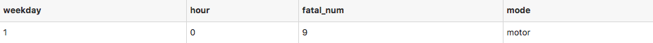
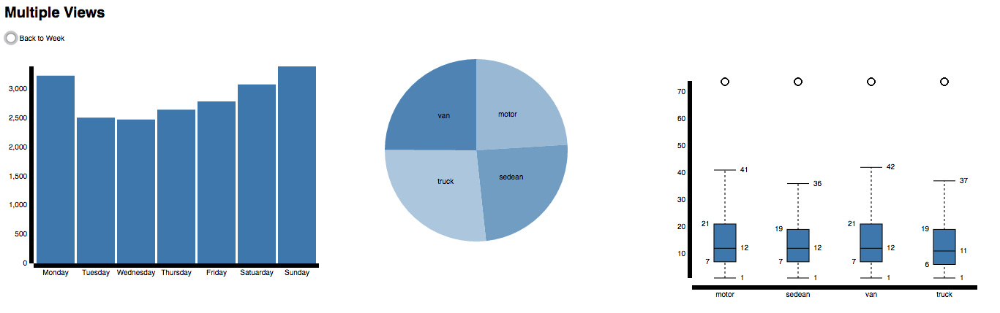
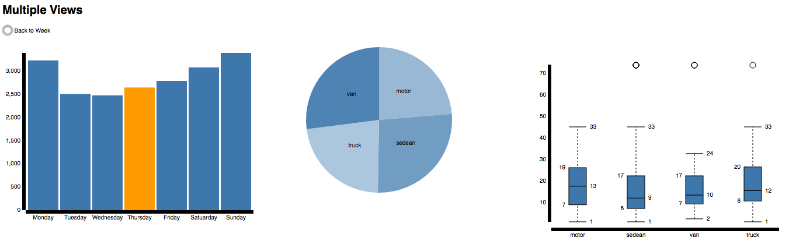
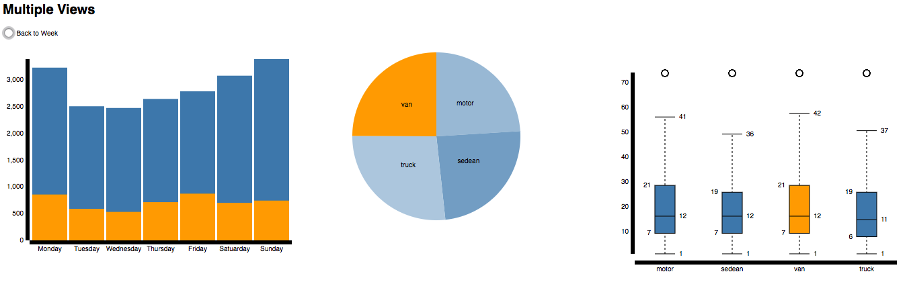
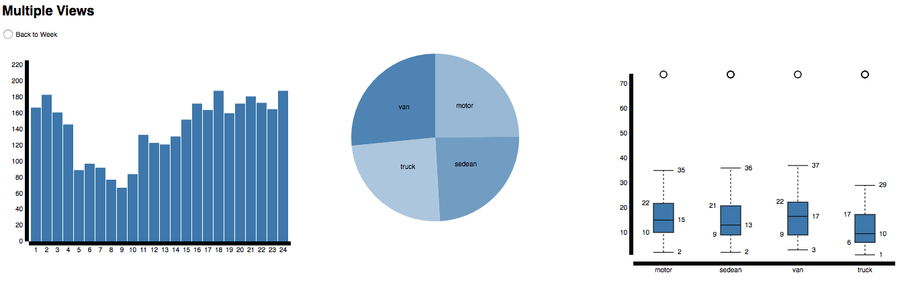
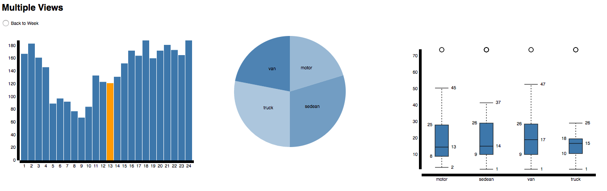
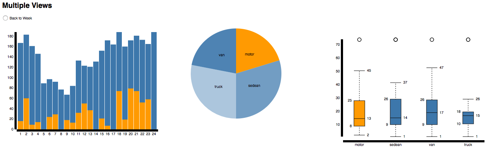
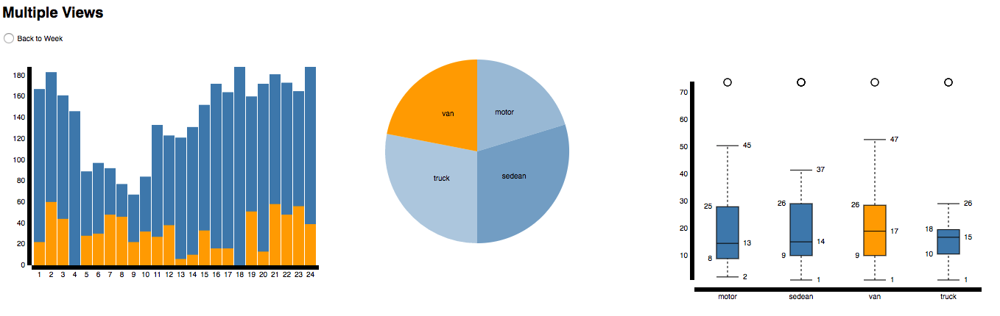

Assignment 5 - Visualizations and Multiple Views  
===
[Link](http://boyazhou1993.github.io/05-MapsAndViews/index.html) to our homework5.

Teams
---
Boya Zhou : boyazhou1993

Yuting Liang : DarienLiang

Introduction to A5
---
Data source: https://github.com/boyazhou1993/DataVisFinal/tree/master/originData/FARS2015NationalCSV

This dataset will be used in our final project, so we are interested in it. 

This data set show the traffic fatalities in year 2015 from many aspects. In this assignment, we foucus on the number of fatalities in one week, and try to find the relations among number of fatalities, weekday, hour and commute mode.

However,the dataset itself is very complex(with 20 csv file in it), so we use python to process it(like join two table). Also, for some data, we need to aggregate it manaully, for example, there are more than 70 ways of commute way in dataset, so we manully make them into 4 groups: van, motor, sedean, truck. There are still other modes do not belong to these 4, we do not consider them in this assignment. As d3 beginner, we mainly focus on d3 event, dispatch in this assignment.

Data complexity:
---
The data contain two time level and one categorical feature, the 'target' feature will always be fatal num.

It looks as below:

   

Visulazation complexity (Description of visualzation):
---
This part will be introduced in this visualzation's 'lifetime' order:

1. load page:
   When first load in page, there are 3 simple views: bar chart, pie chart and box plot, the data is shown in weekday level(there will be hour level latter), it will look as below:
   
   
   
2. mouseover level: mouseover and mouseout bar:
   When mouseover on bar, the pie chart and box plot will update. For example, if you mouse on Monday, the pie chart and boxplot will update show how Monday data look like, and when you mouseout that bar, it will update back to week data level like just load the page, it look as below:
   
   
   
3. mouseover level: mouseover and mouseout pie:
   When mouseover on pie, the bar chart will looks like a stack bar chart, the orange part show data from the commute mode you select, also, the boxplot in same commute mode will turn in orange. Also, when you mouse out, it will change back, it looks like below:
   
   

4. mouseover level: mouseover and mouseout box:
   Almost the same way as [mouseover level: mouseover and mouseout pie], it looks like below:
   
   

5. click level: click bar:
   When you click one bar, it will show in hour level, bar and its axis will be updata, at same time pie and box will be update too, show only data from the day you choose, and even if you mouseout the bar, since you click, the pie and box will not trigger mouseout event in mouseover level. It will looks as below:
   
   
   
6. click leverl: mouseover and mouseout bar:
   Only simple interaction is provided, when you mouse over, the pie and box will not change, what will be changed is only the color of the bar. It will look as below:
   
   
   
7. click leverl: mouseover and mouseout pie:
   Almost as what will happen in [mouseover level: mouseover and mouseout pie], the bar chart will looks like a stack bar chart, the bar in specific commute mode will turn in orange. It will look as below:
   
   
   
8. click leverl: mouseover and mouseout box:
   Same as above. It will look as below:
   
   
   
9. click level: back to week level data:
   click the buttom on top left, the data will change back to week level, the pie and box will update back, too. And it will be as exactly as you load the data. The life cycle ends and begins.

Technical achievements
---
The technical achievements mainly in two aspects: process data in d3 and d3 dispatch

1. process data:
   like map, filter, nest
   
2. d3 dispatch:
   In this assignment, we use dispatch the first time. It will make the events in more clear way.
   What problems we solve related with dipatch are:
   1. send parameter
   2. when to set dispatch listener to null and when to update back 
   3. call or listern to some event only certain event already happen
   4. the coordinate view can be loop again and again 
   5. combine with setTimeOut 

Design achievements
---
   

